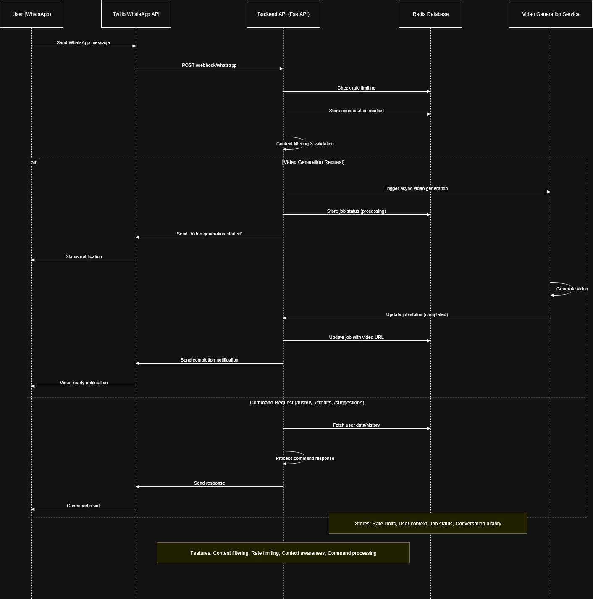

# Video Generation Web App & WhatsApp Bot

---

## Overview

The **Video Generation Web App** and the **WhatsApp AI Video Generation Bot** enable users to generate short videos from text prompts using the state-of-the-art [Vidu API](https://platform.vidu.com/).

- The **Web App** provides a modern frontend, asynchronous FastAPI backend, and job queue management.  
- The **WhatsApp Bot** integrates Twilio, Redis, and FastAPI to bring conversational AI video generation directly into WhatsApp chats.

Both projects are built for **demonstration** and **production-ready** environments.

---

## Features

### Web App
- **Responsive Frontend** – Pure HTML/CSS/JS 
- **Async FastAPI Backend** – Handles job creation, status polling, and video streaming  
- **Job Queue & Tracking** – Real-time updates on video generation progress  
- **Organized Video Storage** – Clean `/videos` directory for generated & fallback videos  
- **Quota Fallback** – Serves a mock video seamlessly if API limits are hit  
- **Deployment Ready** – Secure `.env`, compatible with Render, Railway, etc.  

### WhatsApp Bot
- **Video Generation Command** (`/generate`) – Asynchronous Vidu API integration with cinematic prompt enhancement  
- **Conversation Context System** – Stores chat history and user-specific requests with 7-day expiry and a 50-message cap  
- **User Preference Analysis** – Learns user themes and suggests personalized prompts  
- **Bot Commands:**  
  - `/generate [prompt]` → Create AI-generated video  
  - `/history` → View recent videos & statistics  
  - `/credits` → Check remaining API credits  
  - `/suggestions` → Get personalized video ideas  
  - `/clear` → Reset conversation history  
- **Security & Stability:**  
  - Content filtering (profanity, leetspeak, length checks, repetition prevention)  
  - Redis-based rate limiting (10 messages/hour per user) with graceful fallback if Redis is unavailable  
  - Cross-user data isolation using per-user Redis keys

---

## Architecture

**Component Overview:**  
- FastAPI Backend → Job management, webhook handling, video serving  
- Redis → Context storage, rate limiting, job tracking  
- Twilio WhatsApp API → Messaging & media handling  
- Vidu API → Text-to-video generation pipeline

---

## Model Choice

- **Model Used:** `Vidu API`  
- **Why this model?**  
  - State-of-the-art text-to-video system tailored for short, conversational videos  
  - Fast, scalable, and production-oriented API surface  
  - Handles cinematic prompt enhancements and returns robust short videos

---

## API & Code Structure

### Web App
| Endpoint                  | Method | Purpose                                 |
|---------------------------|--------|-----------------------------------------|
| `/`                       | GET    | Serves `index.html`                     |
| `/style.css`              | GET    | Stylesheet for UI                       |
| `/script.js`              | GET    | Frontend JS logic                       |
| `/api/generate-video`     | POST   | Start video generation, returns `job_id`|
| `/api/status/{job_id}`    | GET    | Poll for job status/progress            |
| `/api/download/{job_id}`  | GET    | Streams generated video file            |

### WhatsApp Bot
- **Webhook Endpoint:** `/webhook/whatsapp`  
- **Bot Commands:** `/generate`, `/history`, `/credits`, `/suggestions`, `/clear`  
- **Redis Keys:** Per-user isolation for job tracking, context, and rate limits

---

## Environment Variables & Security

Secrets are **never committed**. `.env` is excluded via `.gitignore`. Use `python-dotenv` locally; set env vars in your production dashboard.

Example `.env` (example formatting — create this file in your project root):

    VIDU_API_KEY=your_vidu_api_key
    TWILIO_ACCOUNT_SID=your_account_sid
    TWILIO_AUTH_TOKEN=your_auth_token
    TWILIO_WHATSAPP_FROM=whatsapp:+14155238886
    REDIS_URL=redis://localhost:6379

Security notes:
- Do not commit `.env` to git.  
- Use per-environment API keys (dev/staging/prod).  
- Validate & filter all incoming prompts/messages.  
- Rate-limit users and webhook callers.

---

## Setup

### Prerequisites
- Python 3.8+  
- `pip` available  
- (Optional for local Redis) Redis server or Redis Cloud for production  
- Twilio WhatsApp (for bot) and Vidu API account & keys

### Installation Steps (Web App)
1. Clone the repository:
    
        git clone https://github.com/YourUsername/Video-Generator-WebApp.git
        cd Video-Generator-WebApp

2. Create virtual environment:

        python -m venv venv
        # activate venv:
        # macOS/Linux: source venv/bin/activate
        # Windows: venv\Scripts\activate

3. Install dependencies:

        pip install -r requirements.txt

4. Create `.env` in project root and add `VIDU_API_KEY` (see Environment Variables).

5. Ensure `/videos` directory exists (for generated and fallback videos):

        mkdir -p videos

6. Start the server:

        uvicorn main:app --host 0.0.0.0 --port 8000

### Installation Steps (WhatsApp Bot)
1. Install required packages (if not already):

        pip install fastapi uvicorn python-dotenv twilio redis python-multipart requests ffmpeg-python

2. Add Twilio + Redis + Vidu keys to your `.env` (see Environment Variables).

3. Configure Twilio webhook to point to your deployed webhook URL:

    Example webhook URL: `https://your-domain.com/webhook/whatsapp`

4. (Optional) If using local testing, expose your local server with ngrok and set the ngrok URL in Twilio.

5. Deploy to chosen platform (Railway / Render / VPS) and ensure the webhook is reachable.

---

## Deployment

### Web App
- Push the repo to GitHub (exclude `.env`).
- On Render / Railway:
  - Build step: `pip install -r requirements.txt`
  - Start command: `uvicorn main:app --host 0.0.0.0 --port $PORT`
  - Add environment variables in the platform dashboard.
- Ensure `/videos` directory is writable by the app.

### WhatsApp Bot
- Host the FastAPI app on Railway / Render / a VPS with a public HTTPS endpoint.
- Configure Twilio to use your webhook endpoint for incoming messages.
- Use Redis Cloud for context storage and rate limiting in production.
- Monitor API usage and implement quota fallbacks (serve mock video if Vidu quota is exceeded).

---

## Technology Stack

- **Backend:** Python 3.8+, FastAPI, Uvicorn, python-dotenv  
- **Messaging:** Twilio WhatsApp API (bot)  
- **Queue / Cache:** Redis (job tracking, context, rate limiting)  
- **Video API:** Vidu API  
- **Frontend (Web App):** HTML, CSS, JavaScript (no frontend framework)  
- **Deployment:** Railway, Render, or VPS

---

## Credits

Made by **Kushal Panchali**
